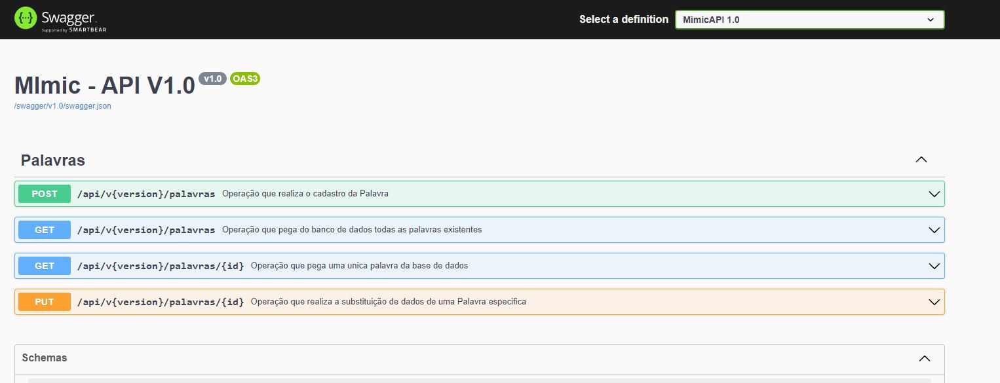
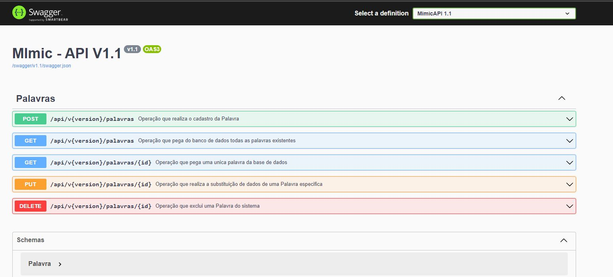
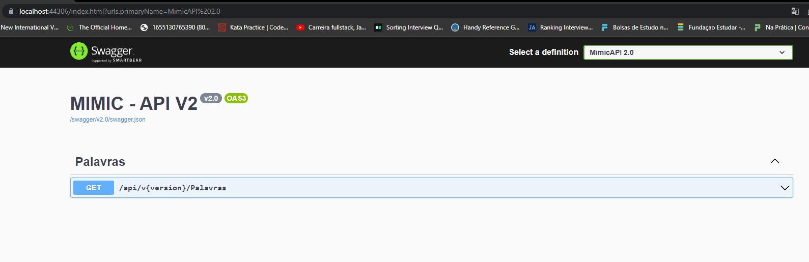

# c# API

=

## 🖼 Screenshot application screen  Versioning 

V1

 
 

 V1.1

 
 

V2

 
 

 
## 🚀 Tech Used 
 

- c# API 
- Sql Server  
- Entity Framework  
- Swagger 
- Auto Mapper  

 

## Linkedin below

<h4 align="center">
   Created by   <a href="https://www.linkedin.com/in/luiz-carlos-b50693173/" target="_blank"> Luiz Carlos </a>
</h4>

</html>
